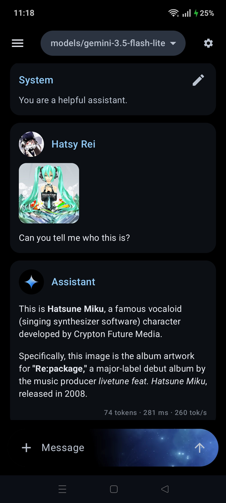
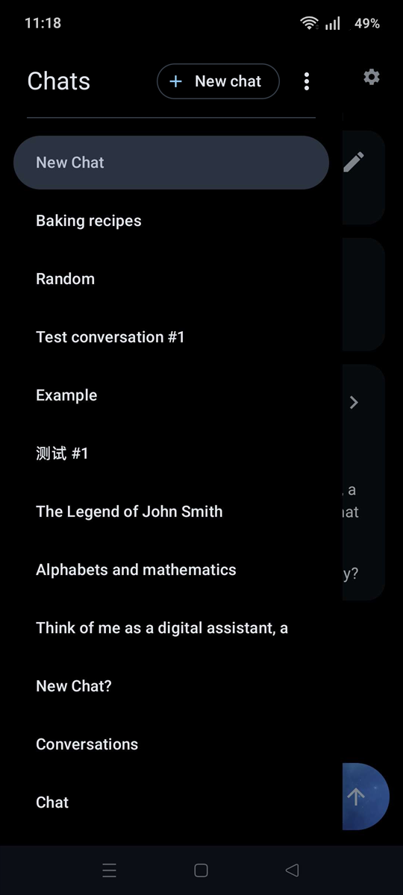
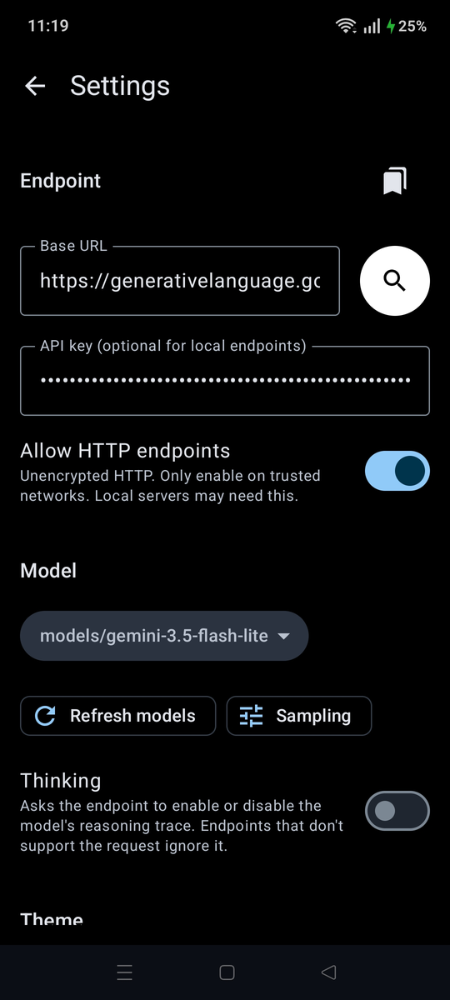
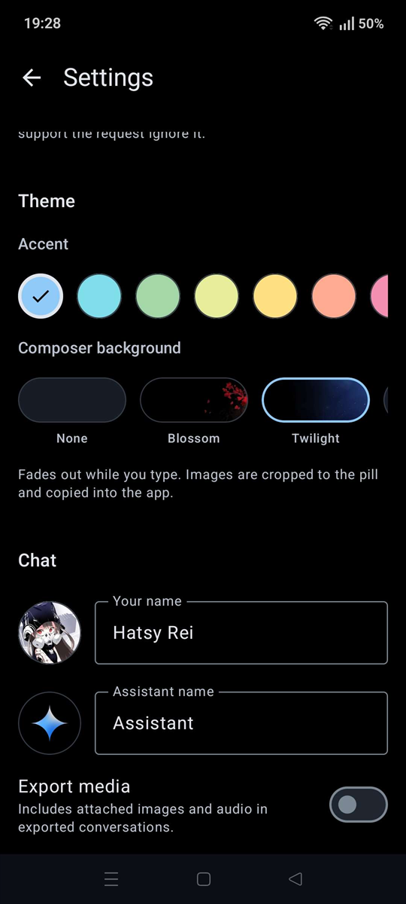

<div align="center">


# Maid Native

A lightweight, Material 3 themed native Android client for OpenAI-compatible
endpoints. No account, no telemetry, no ads — just a ~2.0 MB APK and your own
server.

[](https://developer.android.com)
[](https://kotlinlang.org)
[](https://developer.android.com/compose)
[](LICENSE)
[](https://github.com/HatsyRei/maid-native/releases)

<table align="center">
<tr>
<td width="25%"><a href="docs/screenshots/chat-multimodal.png"></a></td>
<td width="25%"><a href="docs/screenshots/drawer.png"></a></td>
<td width="25%"><a href="docs/screenshots/settings-endpoint.png"></a></td>
<td width="25%"><a href="docs/screenshots/settings-theme.png"></a></td>
</tr>
<tr>
<td align="center"><sub><b>Multimodal chat</b></sub></td>
<td align="center"><sub><b>Chat drawer</b></sub></td>
<td align="center"><sub><b>Endpoint &amp; model</b></sub></td>
<td align="center"><sub><b>Personalisation</b></sub></td>
</tr>
</table>

<sub>Click any screenshot to view it full size.</sub>

</div>

---

## Features

- **Streaming chat** with Markdown rendering — incrementally parsed while the
  reply streams, so long answers stay smooth.
- **Branching conversation trees** — edit, revise or regenerate any message and
  step between siblings with `‹ n/N ›` instead of a linear log.
- **Media attachments** — images, audio and text files, gated on the model's
  reported modalities.
- **Chat import / export** — per-chat, multi-file import, and backup-all via the
  Storage Access Framework, in the RN-compatible JSON format.
- **LAN endpoint discovery** — scan your subnet (configurable port and prefix)
  to find a local llama.cpp / OpenAI-compatible server without typing an IP.
- **API keys encrypted at rest** with an AndroidKeyStore AES/GCM key that never
  leaves the device, and kept out of cloud backups.
- **Works offline** — history lives in Room, so browsing and reading need no
  network at all.
- **Collapsible reasoning** — `<think>` output is rendered separately and folds
  away.
- **Endpoint presets and a model-picker pill** for switching servers and models
  in a couple of taps.
- **Personalisation** — AMOLED-true-black theme with a custom accent colour,
  composer nameplate art (bundled or your own image), and custom user /
  assistant display names and profile pictures.

---

Maid Native (`com.hatsyrei.maidnative`) is a standalone Kotlin/Compose 
reimplementation of the Maid Android app. All credit for the original design
and behaviour it mirrors goes to:

- [Mobile-Artificial-Intelligence/maid](https://github.com/Mobile-Artificial-Intelligence/maid)
  — the original React Native app.
- [HatsyRei/maid](https://github.com/HatsyRei/maid) — the React Native fork this
  port was made from, and the parity reference used throughout.

See [SPEC.md](SPEC.md) for the full port specification and the record of the
migration (now closed — milestones M0–M5 complete). This repo is a self-contained
Gradle project, split out from the RN `maid` repo so the native port can evolve
independently.

## Prerequisites

- Android SDK (`ANDROID_HOME` set, or a `local.properties` with `sdk.dir=...`).
  Requires platform `android-37` (compileSdk; targetSdk is 36) and a matching
  build-tools release.
- JDK 21 (used locally at `~/.local/jdks/jdk-21`). Note that `JAVA_HOME` must
  point at a **JDK**, not a JRE — if `./gradlew` is invoked directly with a JRE
  on `PATH` the build fails; `build.sh` handles this for you.

The toolchain is pinned in `gradle/libs.versions.toml`: Gradle 9.7.1,
AGP 9.3.2, Kotlin 2.4.10, KSP 2.3.11, Compose BOM 2026.08.00. AGP 9 supplies
built-in Kotlin support, so the `org.jetbrains.kotlin.android` plugin is not
applied; the Kotlin and KSP plugin versions are declared on the root
`buildscript` classpath instead.

## Build & deploy

The `build.sh` helper does a **clean** build every time and auto-detects the
local toolchain (falls back to `~/.local/jdks/jdk-21` and `~/android-sdk` if
`JAVA_HOME` / `ANDROID_HOME` are not already exported):

```bash
./build.sh            # clean + release APK (same as `./build.sh release`)
./build.sh debug      # clean + debug APK -> app/build/outputs/apk/debug/
./build.sh release    # clean + signed release APK (arm64-v8a, minified)
./build.sh test       # clean + unit tests
./build.sh install    # clean + release APK + adb install to a connected device
```

Or drive Gradle directly:

```bash
./gradlew assembleDebug      # debug APK -> app/build/outputs/apk/debug/
./gradlew installDebug       # install to a connected device/emulator
./gradlew assembleRelease    # release APK (minified, arm64-v8a only)
```

If `ANDROID_HOME` is not exported, create `local.properties`:

```properties
sdk.dir=/home/<you>/android-sdk
```

> **Signing note:** the release build is signed with the SDK's auto-generated
> debug key (`~/.android/debug.keystore`, alias `androiddebugkey`) — see
> `signingConfig = signingConfigs.getByName("debug")` in `app/build.gradle.kts`.
> No keystore or credential lives in this repo. Debug and release therefore
> share one certificate, so you can install one over the other without
> uninstalling first.
>
> That key is per-machine, so release APKs built from different clones are not
> upgrade-compatible, and a debug-signed APK cannot be published to Play. A real
> release key (path + credentials loaded from a git-ignored `keystore.properties`)
> would be a prerequisite for distribution.

## Status

**Port complete.** Behavioural parity with the React Native app has been reached
and signed off on-device (SPEC §7): streaming chat against an OpenAI-compatible
endpoint, conversation-tree logic (with unit tests), Room persistence, settings,
a chat UI with message controls + branch navigation, a navigation drawer, and
Markdown rendering (incremental while streaming). Signed release APK is ~2.0 MB,
against ~20 MB for the React Native build. Remaining items are post-parity
enhancements, listed in [SPEC.md](SPEC.md) §7.1.

## License

[MIT](LICENSE) © 2026 HatsyRei.
